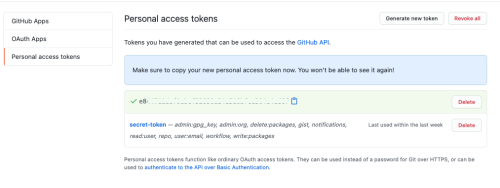
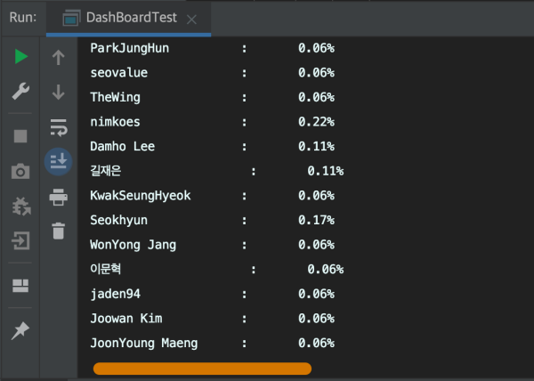

# Live Study Dashboard

백기선님의 [라이브 스터디 4주차 과제](https://github.com/whiteship/live-study/issues/4)를 구현했습니다.

## 요구사항

- 깃헙 이슈 1번부터 18번까지 댓글을 순회하며 댓글을 남긴 사용자를 체크 할 것.
- 참여율을 계산하세요. 총 18회에 중에 몇 %를 참여했는지 소숫점 두자리가지 보여줄 것.
- [Github 자바 라이브러리](https://github-api.kohsuke.org/)를 사용

<br>

## 구현

### Github 토큰 생성

Github API를 사용하기 위해서는 Authentication을 해야하는데, Github API 문서에서 알려주는 방식은 JWT를 이용하는 방식과 Github Token을 이용하는 방식이었다. 문서를 봤을때 Token을 사용하는 방식이 더 간단할것 같아서 난 Token을 선택했다. *(사실 JWT는 잘알지도 못한다..)*

[Github](https://github.com/settings/tokens)에서 Personal access token를 생성했다.



여기서 생성된 토큰 코드는 잃어버리면 새로 생성해야하므로 복사해서 다른 곳에 잠시 붙여뒀다.

API 문서를 보니 토큰 코드를 그대로 작성하지 않고 클래스를 분리하였다. 나도 이 코드를  Github에 올릴 생각이므로 토큰을 외부에 공개하지 않기 위해 token 코드만 저장하는 클래스로 분리하고, getter로 접근해서 가져오는 방식을 채택했다.

```java
public class Token {
   private final static String TOKEN = "github-token-key";
  
   public String getToken() {
      return TOKEN;
   }
}
```

이렇게 하고, Git 이 추적하지 못하게 이 클래스는 gitignore에 포함시켜두었다.

<br>

## Github 객체 생성 및 Repository 가져오기

Github 객체를 생성하는 것을 시작으로 본격적인 개발을 시작했다.

~~~java
public class DashBoardTest {
   public static void main(String[] args) throws IOException {

      // token 가져오기
      Token key = new Token();
      String token = key.getToken();   // token 가져오기
     
      GitHub github =   // token으로 github 빌드
        new GitHubBuilder().withOAuthToken(token).build();
   }
}
~~~

`GithubBuilder()`를 이용하여 Github 객체를 생성하는것 같다.

본 과제는 백기선님 저장소의 이슈에 달린 댓글들로부터 참여자 이름과 참여횟수를 계산해야 하므로 이슈의 댓글에 접근하기 위해서는 먼저 저장소에 접근해야한다.

백기선님 저장소를 Fork 한 저장소 이름을 앞으로 사용할 Github 객체의 Repository로 사용했다.

~~~java
GitHub github =   // token으로 github 빌드
   new GitHubBuilder().withOAuthToken(token).build();
GHRepository repository =  
   github.getRepository("youngjinmo/live-study").getParent();
~~~

그냥 저장소만 가져오면 Fork한 저장소엔 백기선님 저장소의 이슈를 못가져오므로 `.getParent()` 를 이용하면 Fork 저장소의 오리지널 저장소를 가져올 수 있다.

실제로 저장소를 잘 불러왔는지 저장소 이름과 설명을 콘솔에 출력해보았다.

~~~java
System.out.println(repository.getOwnerName());
System.out.println(repository.getName());
System.out.println(repository.getDescription());
~~~

~~~
whiteship
live-study
온라인 스터디
~~~

제대로 저장소를 가져왔음을 확인했다.

~~~java
GHRepository repository =  
   github.getRepository("youngjinmo/live-study").getParent();
~~~

디버거 모드에서 여기에 브레이크 포인트를 걸어도 확인할 수 있는 정보들이다.

메서드로 분리하는 리팩토링을 거쳤다.

~~~java
public class DashBoardTest {
  public static void main(String[] args) throws IOException {
    final String repoName = "youngjinmo/live-study";    // 가져올 저장소 이름 
    
    GHRepository repository = getRepository(repo);  // repository 연동
  }
  
 /**
  *  Token 가져와서 Repository를 만들어서 반환
  *
  * @param repoName
  * @return
  * @throws IOException
  */
  public static GHRepository getRepository(String repoName) throws IOException {
    // token 가져오기
    Token githubToken = new Token();
    String token = githubToken.getToken();
    
    // github 객체 생성
    Github github = new GithubBuilder().withOAuthToken(token).build();
    
    // github 객체로부터 저장소 반환
    return github.gerRepository(repo).getParent();
  }
}
~~~

저장소 이름은 상수로 분리하였다.

<br>

## 전체 이슈 List 타입으로 가져오기

이슈 전체 갯수가 필요한 이유는 향후 과제 제출율을 계산하기 위함이다. 이슈는 아까 생성한 Repository를 통해서 이슈를 가져온다. 

~~~java
public class DashBoardTest {
  public static void main(String[] args) throws IOException {
    final String repo = "youngjinmo/live-study";     // 가져올 저장소 이름 
    
    GHRepository repository = getRepository(repo);   // repository 연동
    
    List<GHIssue> issues = getIssues(repository);    // issue 가져오기
  }
}
~~~

`List`타입의 <>안에 `GHIssue` 를 작성했는데, 이건 `List`에 들어올 수 있는 타입을 `GHIssue`로 강제하기 위함이다. Java 5 부터 생긴 [제네릭](https://docs.oracle.com/javase/tutorial/extra/generics/index.html)이라는 기능이다. 제네릭에 대해선 다른 포스팅[(DevAndy - Generics)](https://youngjinmo.github.io/2020/08/java-generics/)으로 대체하겠다.

~~~java
/**
  *  이슈 List 형태로 가져오기
  *
  * @param repository
  * @return
  * @throws IOException
  */
private static List<GHIssue> getIssues(GHRepository repository) throws IOException {
  return repository.getIssues(GHIssueState.ALL);
}
~~~

과제 제출율을 체크할 것이기 때문에 닫힌 이슈까지만 불러와서 참여횟수를 계산하는게 정확할것 같은데, 그렇게 되면, 열려있지만 아직 과제 마감기한이 지나지 않은 경우를 어떻게 카운팅해야할지가 애매해서 모든 이슈에 대해 카운팅하기로 하였다.

`repository.getIssues()` 를 사용하면 이슈 하나만 가져오는게 아니라 리스트 형태로 이슈 전체를 가져온다. 파라미터에는 이슈의 상태를 넣어준다.

- `GHIssueState.OPEN` : 열려있는 이슈
- `GHIssueState.CLOSED` : 닫힌 이슈
- `GHIssueState.ALL` : 모든 이슈

`getIssue()` 를 사용하면 개별 이슈를 가져올 수 있는데, 파라미터로 인덱스를 넣어줘야 한다. 이건 다음 메서드에서 이슈 댓글을 가져올때 사용할 예정이다.

<br>

## 이슈 댓글로부터 참여자 이름, 참여횟수 가져오기

각 이슈에 댓글로 선원분들이 과제를 제출하고 있기 때문에 댓글을 가져와서 댓글로부터 댓글작성자 이름을 추출하고, 참여횟수를 계산해서 이 데이터들을 컬렉션 Map에 저장하려고한다.

~~~java
public class DashBoardTest {
  public static void main(String[] args) throws IOException {
    // 가져올 저장소 이름 
    final String repo = "youngjinmo/live-study";
    
    // repository 연동
    GHRepository repository = getRepository(repo);
    
    // issue 가져오기
    List<GHIssue> issues = getIssues(repository);
    
    // 이슈 댓글에서 참여자 정보(이름, 참여횟수) 가져오기
    Map<String, Integer> members = getParticipants(issues);
  }
}
~~~

댓글을 추출하기 위해서는 댓글의 부모 객체(?)에 해당하는 이슈가 필요하다. 이슈를 파라미터로 받으면서 Map 컬렉션을 반환하는 메서드를 생성했다. 

~~~java
private static Map<String, Integer> getParticipants(List<GHIssue> issues) throws IOException {
  // 참여자 이름과 참석수 담을 컬렉션 선언
  Map<String, Integer> members = new HashMap<>();
}
~~~

컬렉션으로 Map을 사용한 이유는 **<key, value>** 를 한쌍으로 담을 자료구조가 필요했기 때문이다. 문자열 이름을 key로, 정수형 참여횟수를 타입으로 담을 것이므로 `Map<String, Integer>` 로 선언했다.

HashMap은 Map 컬렉션 인터페이스에서 많이 사용하는 타입이어서 사용했다. 컬렉션에 대해서는 향후 라이브 스터디를 통해 더 공부해볼 생각이다.

메서드에서 들어오는 파라미터는 `List<GHIssues>` 이므로 인덱스를 사용하여 개별 이슈를 가져올 필요가 있다. for 문에서 iterator를 인덱스로 활용하여 이슈를 가져온다. 

~~~java
// Repository의 Issue들을 iterator 돌려서 개별 이슈 가져오기
for (int i = issues.size()-1; i >= 0; i--) {
  GHIssue issue = issues.get(i);   // 인덱스로 개별 이슈 가져오기
}
~~~

for 문은 이슈 전체 개수(`issues.size()`)에서 1을 뺀 수부터 0까지 1씩 감소하는 iterator를 사용하였다. Github에서 이슈의 번호를 이슈 생성 순서부터 인덱싱하지 않고, 가장 마지막에 생성한 이슈부터 0으로 인덱싱했기 때문에 거꾸로 시작했다. 

-1을 한 이유는 Github의 인덱스가 0부터 시작하기 때문에 마지막 이슈의 인덱스는 이슈 전체 개수보다 하나 부족하기 때문이다. 

이렇게 하면 생성 순서대로 이슈를 가져올 수 있다.

~~~java
for (int i = issues.size()-1; i >= 0; i--) {
   GHIssue issue = issues.get(i);
  
   for (int j = 0; j < issue.getComments().size(); j++) {
      GHIssueComment comment = issue.getComments().get(j);  // 댓글 가져오기
      String memberName = comment.getUser().getName();      // 작성자 이름 추출
   }
}
~~~

중첩 반복문을 생성했다. 각 이슈 리스트에서 개별 이슈를 추출하고, 이 개별 이슈에서 다시 댓글을 추출해야하기 때문이다.

댓글을 가져오고 댓글로부터 작성자 이름까지 추출했다. 이제 이렇게 가져온 작성자 이름과 참여횟수를 key, value 쌍으로 컬렉션에 담을 차례이다.

~~~java
// 참여자 이름과 참석수 담을 컬렉션 선언
Map<String, Integer> members = new HashMap<>();

for (int i = issues.size()-1; i >= 0; i--) {
   GHIssue issue = issues.get(i);
   int participant = 1;   // 참여횟수 초기화
  
   for (int j = 0; j < issue.getComments().size(); j++) {
      GHIssueComment comment = issue.getComments().get(j);
      String memberName = comment.getUser().getName();    
     
      if(members.containsKey(memberName)){  // 작성한 이력이 있는 경우 참여횟수 가져오기
        participant = members.get(memberName)+1;
        members.put(memberName,participant);
      } else {
        members.put(memberName,participant);
      }
   }
}
~~~

저장하기 전, 조건문으로 댓글 작성자의 이름이 컬렉션(`members`)에 저장되어 있다면, 참여이력이 있다는 것이므로 작성자 이름을 key로 조회하여 참여횟수를 가져온다. 없으면 초기값 1로 그대로 컬렉션에 저장한다.

완성된 메서드이다.

~~~java
/**
* 이슈의 댓글에서 참여자 이름과 참여횟수 가져오기
*
* @param issues
* @return
* @throws IOException
*/
private static Map<String, Integer> getParticipants(List<GHIssue> issues) throws IOException {
  // 참여자 이름과 참석수 담을 컬렉션 선언
  Map<String, Integer> members = new HashMap<>();

  // Repository의 Issue들을 iterator 돌려서 개별 이슈 가져오기
  for (int i = issues.size()-1; i >= 0; i--) {
    GHIssue issue = issues.get(i);   // 인덱스로 개별 이슈 가져오기
    int participant = 1;
    
    for (int j = 0; j < issue.getComments().size(); j++) {
      GHIssueComment comment = issue.getComments().get(j);  // 이슈에서 댓글 추출
      String memberName = comment.getUser().getName();      // 댓글에서 작성자 이름 추출
      
      if(members.containsKey(memberName)){  // 작성한 이력이 있는 경우 참여횟수 가져오기
        participant = members.get(memberName)+1;
        members.put(memberName,participant);
      } else {
        members.put(memberName,participant);
      }
    }
  }
  return members;
}
~~~

<br>

## 작성자 이름과 참여율 출력하기

이제 위 메서드를 최종적으로 콘솔에 작성자 이름과 참여율을 출력할 차례이다. 참여율 계산을 위해서는 참여자 이름과 참석횟수가 담긴 Map 자료구조와 이슈 전체 갯수가 파라미터로 필요하다.

~~~java
public class DashBoardTest {
  public static void main(String[] args) throws IOException {
    // 가져올 저장소 이름 
    final String repo = "youngjinmo/live-study";
    
    // repository 연동
    GHRepository repository = getRepository(repo);
    
    // issue 가져오기
    List<GHIssue> issues = getIssues(repository);
    
    // 이슈 댓글에서 참여자 정보(이름, 참여횟수) 가져오기
    Map<String, Integer> members = getParticipants(issues);
    
    // 멤버이름과 참여율 출력하기
    printOutParticipantsRate(members, issues.size());
  }
}
~~~

반복문을 사용하여 파라미터로 들어온 `members`로부터 참여자별 참여횟수를 가져와서 마찬가지로 파라미터로 들어온 전체 이슈갯수로 연산하여 참석율을 double 형 변수에 담았다.

그리고 `printf` 를 이용하여 출력을 했다. 반환할 데이터가 없으므로 메서드의 타입은 `void`로 했다.

~~~java
/**
 *  멤버 이름과 참여율 출력
 *
 * @param data
 * @param countAllIssues
 */
 private static void printOutParticipantsRate(Map<String, Integer> members, int countAllIssues){
    for (String name : members.keySet()) {
       double rate = (double)members.get(name)/(double)countAllIssues;   // 참여율 계산
       System.out.printf("\n%-20s : %10.2f%s",name,rate,"%");
    }
 }
~~~

`.keySet()` 은 Map 자료구조의 key를 Set 인터페이스로 반환하는 메서드이다. 아직 Set이 익숙지 않은데, 이 또한 향후 컬렉션을 다루는 라이브 스터디에서 공부해봐야겠다. 결과적으로 `.ketSet()`은 Map 자료구조의 key 전체를 반환하며 for-each문에 의해 하나의 key를 iterator로 인식하며, 이 때 iterator를 문자열 변수 `name`으로 사용할 수 있다.

~~~java
System.out.printf("\n%-20s : %10.2f%s",name,rate,"%");
~~~

`printf`는 데이터 타입에 맞춰 변수를 포맷팅(formatting)하여 출력할 수 있는 출력문이다.

- `%s` : 문자열을 포맷팅한다.
- `%d` : 정수형과 매핑된다.
- `%f` : 실수형과 매핑된다.

위의 포맷팅 출력문을 분석하면, `\n` 은 줄바꿈하고 한줄씩 출력하는 코드이고, `%-20s` 는 20 바이트 크기로 고정하고 문자열을 출력한다. 이렇게 하면 문자열 변수의 크기가 각각 달라도 일정 간격으로 출력할 수 있다.

## 프로그램 실행

실제로 프로그램을 실행하니 시간이 오래걸려서 이슈갯수와 댓글 갯수를 작게 변경하고 테스트 차원에서 실행해보았다.



